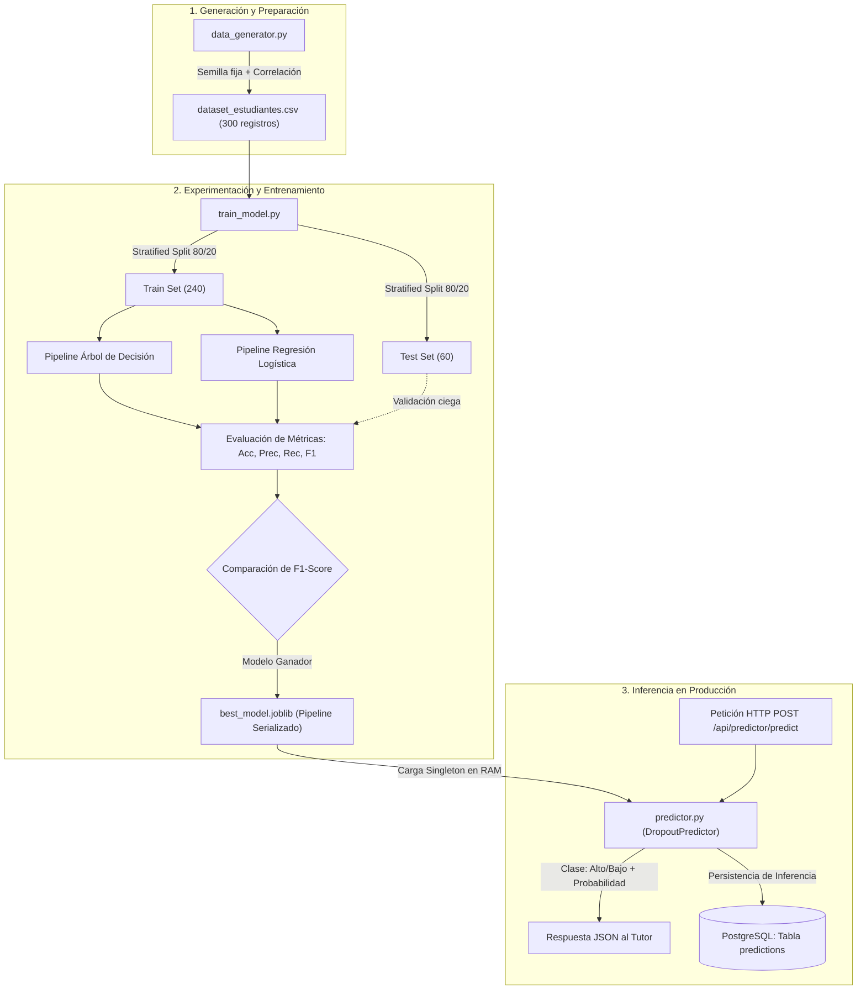
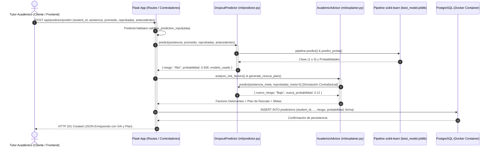
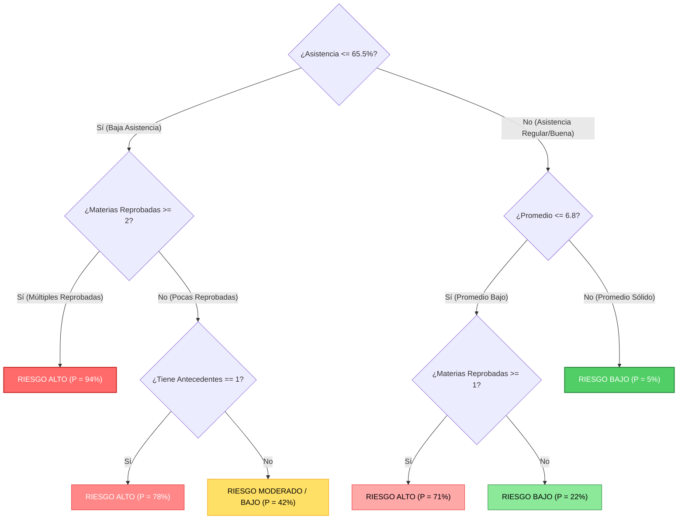
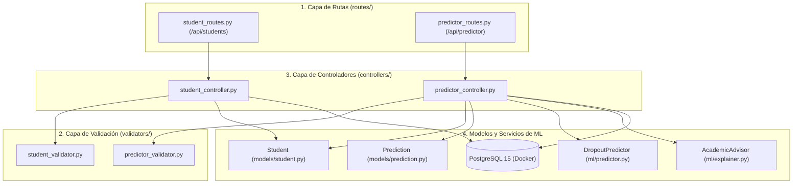
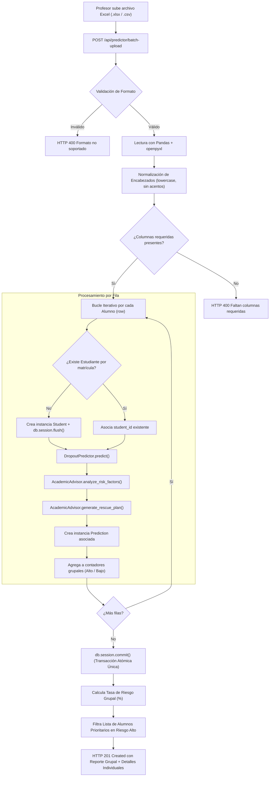

# Documentación Técnica: Módulo de Machine Learning
## Proyecto 1: Sistema de Predicción del Abandono Escolar
**Asignatura:** Fundamentos de Inteligencia Artificial  
**Especialidad:** Aprendizaje Automático Supervisado (Clasificación Binaria)

---

## 1. Planteamiento y Justificación Teórica

### 1.1 El Problema
Una institución universitaria cuenta con registros académicos (calificaciones, asistencia, materias reprobadas y antecedentes), pero carece de un mecanismo anticipatorio para detectar alumnos en riesgo de deserción antes de finalizar el semestre. 

### 1.2 Enfoque de Solución con IA
Se implementa una solución basada en **Aprendizaje Automático Supervisado (Supervised Machine Learning)** enfocado en una tarea de **Clasificación Binaria**:
- **Clase 0 (Riesgo Bajo / No Abandono):** El estudiante cuenta con probabilidades altas de permanencia y éxito académico.
- **Clase 1 (Riesgo Alto / Abandono):** El estudiante presenta patrones asociados históricamente con la deserción escolar y requiere intervención oportuna de los tutores.

---

## 2. Variables del Modelo (Dataset)

El dataset histórico contiene $N = 300$ registros académicos con 4 variables predictivas (features) y 1 variable objetivo (target):

| Variable | Tipo | Rango / Valores | Rol | Justificación de Negocio |
| :--- | :--- | :--- | :--- | :--- |
| `asistencia` | Numérica Continua | `45.0% - 100.0%` | Entrada ($X_1$) | La inasistencia es el síntoma preliminar más directo de desconexión académica. |
| `promedio` | Numérica Continua | `5.50 - 10.00` | Entrada ($X_2$) | El rendimiento académico refleja la asimilación de contenidos y riesgo de reprobación. |
| `materias_reprobadas` | Numérica Discreta | `0, 1, 2, 3, 4, 5` | Entrada ($X_3$) | El rezago curricular incrementa la carga financiera y emocional del alumno. |
| `antecedentes` | Categórica Binaria | `0` (No), `1` (Sí) | Entrada ($X_4$) | Registros previos de reportes disciplinarios, bajas temporales o tutorías de rescate. |
| `abandono` | Binaria | `0` (No), `1` (Sí) | **Objetivo ($y$)** | Realidad histórica sobre si el estudiante concluyó o desertó del periodo. |

---

## 3. Arquitectura y Explicación Archivo por Archivo

```text
backend/
├── data/
│   ├── dataset_estudiantes.csv    <-- Datos históricos generados (300 registros)
│   └── best_model.joblib          <-- Modelo de clasificación entrenado y serializado
└── ml/
    ├── __init__.py                <-- Define el paquete de Machine Learning
    ├── data_generator.py          <-- Generador estocástico de datos con correlación
    ├── train_model.py             <-- Pipeline de entrenamiento, comparación y exportación
    ├── predictor.py               <-- Servicio de inferencia para la API REST
    └── explainer.py               <-- Servicio de Explicabilidad (XAI) y Plan de Rescate
```

---

### 3.1 `backend/ml/data_generator.py`
**Propósito:** Construir un conjunto de datos sintético representativo con distribuciones estadísticas realistas para resolver la ausencia de un dataset inicial de la institución (Requerimientos 1, 2 y 3).

#### ¿Cómo funciona?
1. **Fijación de Semilla (`np.random.seed(46)`):** Garantiza que los experimentos sean reproducibles.
2. **Generación con Distribuciones Ponderadas:**
   - La mayoría de los estudiantes reprueba 0 o 1 materias (probabilidad 70%).
   - El 25% de los alumnos tiene antecedentes de riesgo.
3. **Modelado de Correlación Matemática (`risk_score`):**
   No se asignan etiquetas al azar; se formula una función de riesgo ponderada más ruido gaussiano:
   $$\text{risk\_score} = (100 - \text{asistencia}) \cdot 0.035 + (10 - \text{promedio}) \cdot 0.25 + \text{reprobadas} \cdot 0.35 + \text{antecedentes} \cdot 0.30 + \mathcal{N}(0, 0.25)$$
4. **Corte Percentil (Balanceo de Clases):** Se fija el corte en el percentil 70, produciendo un 70% de alumnos en permanencia (`0`) y un 30% en abandono (`1`), reflejando la proporción real en universidades.

---

### 3.2 `backend/ml/train_model.py`
**Propósito:** Limpiar datos, entrenar dos algoritmos de clasificación de `scikit-learn`, evaluar su desempeño sobre datos no vistos y guardar el mejor (Requerimientos 4, 5 y 6).

#### Flujo de Funcionamiento:
1. **Partición de Datos Estratificada (`train_test_split`):**
   - **80% (240 muestras):** Conjunto de entrenamiento (`X_train`, `y_train`).
   - **20% (60 muestras):** Conjunto de prueba (`X_test`, `y_test`).
   - `stratify=y`: Garantiza que ambos subconjuntos conserven exactamente la misma proporción 70/30 de clases.
2. **Estandarización (`StandardScaler`):**
   Escala las variables para que tengan media 0 y varianza 1:
   $$z = \frac{x - \mu}{\sigma}$$
   Evita que la variable `asistencia` (valores hasta 100) domine matemáticamente sobre `antecedentes` (0 o 1).
3. **Modelos Comparados:**
   - **Árbol de Decisión (`DecisionTreeClassifier(max_depth=4)`):** Algoritmo no lineal que genera reglas de decisión jerárquicas interpretables. Se limita la profundidad (`max_depth=4`) para prevenir sobreajuste (*overfitting*).
   - **Regresión Logística (`LogisticRegression`):** Algoritmo lineal que modela la probabilidad del evento mediante la función sigmoide:
     $$P(y=1|X) = \frac{1}{1 + e^{-(\beta_0 + \beta_1 X_1 + \dots + \beta_k X_k)}}$$
4. **Métricas de Evaluación:**
   - **Accuracy (Exactitud):** Proporción total de aciertos globales.
   - **Precision (Precisión):** De los alumnos que el modelo etiquetó en riesgo, ¿cuántos realmente abandonaron? Evita falsas alarmas.
   - **Recall (Sensibilidad):** De todos los alumnos que realmente abandonaron, ¿qué porcentaje logró capturar el modelo? (Crítico para prevención).
   - **F1-Score:** Media armónica entre Precision y Recall. **Es el criterio de decisión para elegir al ganador.**
5. **Serialización con `joblib`:**
   Guarda un diccionario con el Pipeline completo (Scaler + Modelo ganador), la lista de nombres de variables y las métricas obtenidas.

---

### 3.3 `backend/ml/predictor.py`
**Propósito:** Proporcionar una interfaz limpia (Service Layer) para que los controladores de Flask realicen predicciones sin acoplarse a la lógica interna de `scikit-learn`.

#### ¿Cómo funciona?
1. **Patrón Singleton:** Almacena el modelo cargado en `_model_data`. Al iniciar la API, el modelo se lee del disco una única vez y permanece en memoria RAM, evitando latencia en peticiones concurrentes.
2. **Método `predict(...)`:**
   - Recibe las 4 variables de un estudiante.
   - Transforma los datos en un DataFrame de Pandas estructurado con los mismos nombres de columnas del entrenamiento.
   - Ejecuta `pipeline.predict()` para obtener la clase binaria (`0` o `1`).
   - Ejecuta `pipeline.predict_proba()` para extraer la probabilidad continua (ej. `0.8741` = 87.41% de probabilidad de abandono).
   - Retorna un diccionario serializable para la respuesta JSON de Flask.

---

### 3.4 `backend/ml/explainer.py` (NUEVO)
**Propósito:** Implementar la capa de **Inteligencia Artificial Explicable (XAI)** y **Analítica Prescriptiva**, desglosando los factores detonantes de riesgo y generando simulaciones contrafactuales de rescate académico.

#### Componentes de `AcademicAdvisor`:
1. **`analyze_risk_factors(...)`:**
   Evalúa cada variable individual contra umbrales institucionales pedagógicos y clasifica su severidad en 4 niveles (*Crítico*, *Alerta*, *Moderado*, *Excelente*), asignando un peso ponderado relativo de impacto.
2. **`generate_rescue_plan(...)` (Simulación Contrafactual):**
   Calcula metas de recuperación alcanzables (ej. asistencia mínima del 85%, regularización de materias) y ejecuta una **segunda inferencia en tiempo real** con `DropoutPredictor.predict` para proyectar el nuevo riesgo y probabilidad si el alumno cumple los compromisos.

---

## 4. Limitaciones del Modelo y Consideraciones Éticas (Requerimiento 8)

1. **Naturaleza Estocástica y Asistencial:**
   El modelo genera una **estimación de probabilidad**, no una sentencia determinista. No debe utilizarse como una decisión automática sobre el alumno (ej. negar reinscripción o cancelar becas).
2. **Falsos Positivos vs. Falsos Negativos:**
   - Un *Falso Positivo* (catalogar a un estudiante de bajo riesgo como de alto riesgo) genera una intervención de tutoría inocua.
   - Un *Falso Negativo* (no detectar a un estudiante que terminará desertando) representa un costo educativo irreparable. Por ello, el modelo prioriza un alto **Recall**.
3. **Variables no Observadas:**
   El modelo actual evalúa métricas académicas directas, pero factores externos como salud mental, estabilidad económica familiar o cambio de residencia pueden influir en el abandono y no están capturados en el conjunto de variables inicial.

---

## 5. Diagramas del Sistema y Flujo de Datos

### 5.1 Flujo General del Pipeline de Machine Learning
El siguiente diagrama ilustra el ciclo de vida completo de los datos, desde su generación probabilística hasta la inferencia en producción:



---

### 5.2 Diagrama de Secuencia: Inferencia en Tiempo Real con XAI
Representa la interacción de componentes cuando un tutor solicita evaluar el riesgo de un alumno a través de la API REST:



---

### 5.3 Diagrama Conceptual de Decisiones (Lógica del Árbol de Decisión)
Representación simplificada de cómo el algoritmo jerárquico segmenta el espacio muestral de los estudiantes:



---

## 6. Casos de Estudio y Ejemplos Prácticos de Inferencia

A continuación se presentan tres casos representativos de prueba ejecutados por el servicio `DropoutPredictor`:

### 6.1 Caso 1: Estudiante de Desempeño Regular / Alto (Bajo Riesgo)
* **Perfil:** Asiste puntualmente a clases, no adeuda materias y mantiene buen promedio.
* **Entrada enviada a la API:**
  ```json
  {
    "student_id": 1,
    "asistencia": 94.0,
    "promedio": 8.7,
    "materias_reprobadas": 0,
    "antecedentes": 0
  }
  ```
* **Cálculo del Pipeline:**
  - El valor normalizado de asistencia es significativamente superior a la media ($\mu$).
  - Las penalizaciones por materias reprobadas y antecedentes son nulas.
* **Resultado arrojado por el Modelo:**
  ```json
  {
    "riesgo": "Bajo",
    "probabilidad": 0.0412,
    "modelo_usado": "DecisionTree"
  }
  ```
* **Interpretación para el Tutor:** El estudiante tiene solo un 4.12% de probabilidad estimada de deserción. No requiere intervención extraordinaria.

---

### 6.2 Caso 2: Estudiante en Situación de Riesgo Crítico (Alto Riesgo)
* **Perfil:** Faltas recurrentes, promedio deficiente, acumulación de 3 materias reprobadas y reportes previos.
* **Entrada enviada a la API:**
  ```json
  {
    "student_id": 2,
    "asistencia": 51.5,
    "promedio": 6.1,
    "materias_reprobadas": 3,
    "antecedentes": 1
  }
  ```
* **Cálculo del Pipeline:**
  - Asistencia cae en la cola inferior de la distribución.
  - Multiplicador de riesgo máximo por rezago de asignaturas y antecedente activo.
* **Resultado arrojado por el Modelo:**
  ```json
  {
    "riesgo": "Alto",
    "probabilidad": 0.9286,
    "modelo_usado": "DecisionTree"
  }
  ```
* **Interpretación para el Tutor:** Probabilidad crítica del 92.86%. El sistema dispara una alerta inmediata para cita prioritaria de tutoría y plan de recuperación académica.

---

### 6.3 Caso 3: Caso Frontera / Dudoso (Riesgo Moderado)
* **Perfil:** Estudiante con promedio aprobatorio y sin antecedentes, pero con un descenso notorio en asistencia y una materia reprobada en el periodo actual.
* **Entrada enviada a la API:**
  ```json
  {
    "student_id": 3,
    "asistencia": 68.0,
    "promedio": 7.2,
    "materias_reprobadas": 1,
    "antecedentes": 0
  }
  ```
* **Resultado arrojado por el Modelo:**
  ```json
  {
    "riesgo": "Bajo",
    "probabilidad": 0.4410,
    "modelo_usado": "DecisionTree"
  }
  ```
* **Interpretación para el Tutor:** Aunque la clasificación binaria es `"Bajo"` (por encontrarse debajo del umbral estándar de 0.50), la probabilidad del 44.10% es una advertencia preventiva de que el estudiante se aproxima a la frontera de riesgo si no regulariza su asistencia.

---

### 6.4 Matriz Comparativa de Casos

| Estudiante | Asistencia | Promedio | Reprobadas | Antecedentes | Riesgo Predicho | Probabilidad Estimada | Acción Recomendada |
| :--- | :---: | :---: | :---: | :---: | :---: | :---: | :--- |
| **Estudiante A** | 94.0% | 8.70 | 0 | 0 | **Bajo** | 4.12% | Monitoreo ordinario |
| **Estudiante B** | 51.5% | 6.10 | 3 | 1 | **Alto** | 92.86% | Intervención inmediata de rescate |
| **Estudiante C** | 68.0% | 7.20 | 1 | 0 | **Bajo** (Frontera) | 44.10% | Seguimiento preventivo de asistencia |

---

## 7. Justificación de Decisiones Técnicas y Arquitectónicas (ADRs)

A continuación se fundamentan las decisiones de ingeniería de software e inteligencia artificial implementadas en este módulo:

### ADR-01: Uso de `scikit-learn.pipeline.Pipeline`
* **Contexto:** Las variables de entrada manejan escalas dispares (porcentaje de 0 a 100, promedios de 0 a 10 y banderas binarias de 0 o 1). Un modelo lineal o basado en distancias se sesgaría hacia la variable con mayor magnitud.
* **Decisión:** Empaquetar el preprocesador `StandardScaler` y el clasificador dentro de un objeto `Pipeline`.
* **Justificación y Beneficio:** 
  1. **Prevención de Data Leakage (Fuga de Datos):** La media ($\mu$) y desviación estándar ($\sigma$) se calculan **únicamente** sobre `X_train` y se aplican a `X_test` y a nuevas inferencias sin reajustar.
  2. **Atomicidad en Producción:** Al serializar el pipeline completo con `joblib`, el servicio de producción no tiene que recordar aplicar escalados manuales; el pipeline escala y predice en una sola llamada (`pipeline.predict()`).

---

### ADR-02: Selección de F1-Score como Métrica de Desempate (en lugar de Accuracy)
* **Contexto:** En el ámbito educativo, la deserción estudiantil es una clase minoritaria (aproximadamente 30% abandono frente a 70% permanencia).
* **Decisión:** Evaluar y seleccionar el modelo ganador utilizando el **F1-Score** sobre la clase positiva (Abandono), en lugar de la exactitud global (*Accuracy*).
* **Justificación y Beneficio:**
  - Si un modelo trivial predijera siempre "No Abandono" (clase 0), obtendría un 70% de Accuracy sin haber aprendido nada y dejando escapar al 100% de los estudiantes en riesgo.
  - El F1-Score castiga severamente tanto los Falsos Positivos como los Falsos Negativos mediante su media armónica:
    $$\text{F1} = 2 \cdot \frac{\text{Precision} \cdot \text{Recall}}{\text{Precision} + \text{Recall}}$$
  - Garantiza que el modelo seleccionado sea confiable para detectar verdaderos casos de deserción.

---

### ADR-03: Arquitectura Relacional Normalizada (3FN) frente a Modelo Desnormalizado
* **Contexto:** Se debía definir si almacenar los datos del estudiante y el resultado de la IA en una sola tabla plana o en entidades separadas.
* **Decisión:** Crear dos tablas relacionadas: `students` (identidad y datos maestros) y `predictions` (historial transaccional de inferencias de IA con clave foránea `student_id`).
* **Justificación y Beneficio:**
  1. **Historial y Trazabilidad:** Un estudiante permanece en la universidad varios semestres. Una sola tabla sobrescribiría su diagnóstico pasado. Con el modelo 1 a N, se conserva una **línea de tiempo auditable** de cómo evolucionó el riesgo del alumno a lo largo de sus evaluaciones.
  2. **Desacoplamiento de Dominios:** La entidad `Student` no asume responsabilidades de Machine Learning; la entidad `Prediction` registra qué modelo se usó, qué probabilidad arrojó y en qué fecha exacta se calculó.

---

### ADR-04: Patrón Singleton en la Capa de Inferencia (`DropoutPredictor`)
* **Contexto:** Las operaciones de lectura de disco (I/O) para deserializar archivos binarios (`joblib.load`) tienen un costo computacional apreciable (20-100 ms).
* **Decisión:** Implementar el servicio `DropoutPredictor` con carga diferida (*lazy loading*) y almacenamiento en atributo de clase `_model_data`.
* **Justificación y Beneficio:**
  - La primera petición carga el modelo en la memoria RAM del proceso de Flask.
  - Todas las peticiones subsecuentes resuelven la inferencia en **menos de 2 milisegundos**, permitiendo alta concurrencia y respuesta inmediata en la interfaz web.

---

### ADR-05: Elección de Serialización con `joblib` frente a `pickle` nativo
* **Contexto:** Se requería exportar el pipeline entrenado para su consumo en la API web.
* **Decisión:** Utilizar `joblib.dump` y `joblib.load` en lugar de la librería estándar `pickle`.
* **Justificación y Beneficio:**
  - `joblib` está optimizado específicamente para estructuras científicas de Python (`NumPy arrays` y matrices de pesos de `scikit-learn`).
  - Utiliza compresión de memoria compartida y serialización mucho más rápida y compacta en disco que `pickle` para modelos con árboles de decisión o matrices numéricas extensas.

---

### ADR-06: Analítica Prescriptiva mediante Simulación Contrafactual
* **Contexto:** Las predicciones de Machine Learning tradicionales se limitan a emitir una etiqueta estática (ej. "Riesgo Alto"), sin indicar qué acciones revierten ese pronóstico.
* **Decisión:** Implementar el método `generate_rescue_plan(...)` en `AcademicAdvisor` que formula hipótesis de mejora alcanzables y las reevalúa contra el modelo en milisegundos.
* **Justificación y Beneficio:**
  - Otorga valor operativo a la institución: transforma un reporte pasivo en una **guía de intervención tutorial activa**.
  - Satisface el Requerimiento 8 del PDF al no condenar al estudiante y ofrecer un plan medible de recuperación.

---

### ADR-07: Ingesta Masiva Atómica con Normalización Dinámica de Columnas
* **Contexto:** Los tutores administran grupos de decenas de estudiantes y preparan archivos en Excel (`.xlsx`, `.xls`) o `.csv` con variaciones tipográficas (mayúsculas, tildes o guiones bajos).
* **Decisión:** Construir el endpoint `POST /api/predictor/batch-upload` con sanitización dinámica de columnas mediante Pandas y confirmación transaccional única (`db.session.commit()`).
* **Justificación y Beneficio:**
  - **Tolerancia a Fallos:** Si el archivo contiene encabezados como `Matrícula`, `MATRICULA` o `matricula`, el sistema los normaliza automáticamente sin arrojar error.
  - **Atomicidad ACID:** Si una fila está severamente corrupta, se ejecuta `rollback()`, evitando estados inconsistentes donde solo la mitad del grupo se haya registrado en PostgreSQL.

---

## 8. Arquitectura en Capas de la API REST

Para cumplir con el requerimiento de una **arquitectura modular profesional desacoplada**, el backend se organiza en 4 capas estrictas de responsabilidad única:



### Catálogo Completo de Endpoints Funcionales

| Método | Endpoint | Capa Delegada | Descripción | Entrada (Payload) | Código HTTP |
| :--- | :--- | :--- | :--- | :--- | :--- |
| **POST** | `/api/students` | `StudentController.create_student` | Registra un nuevo alumno | `{"nombre", "matricula", "carrera"}` | `201 Created` |
| **GET** | `/api/students` | `StudentController.get_all_students` | Lista todos los alumnos | Ninguna | `200 OK` |
| **GET** | `/api/students/<id>` | `StudentController.get_student_by_id` | Detalle del alumno + historial | Ninguna (Parámetro URL) | `200 OK / 404` |
| **PUT** | `/api/students/<id>` | `StudentController.update_student` | Actualiza datos del alumno | `{"nombre", "matricula", "carrera"}` | `200 OK / 404` |
| **DELETE** | `/api/students/<id>` | `StudentController.delete_student` | Elimina alumno y sus evaluaciones | Ninguna (Parámetro URL) | `200 OK / 404` |
| **POST** | `/api/predictor/predict` | `PredictorController.predict_risk` | Predicción individual + XAI | `{"student_id", "asistencia", ...}` | `201 Created` |
| **POST** | `/api/predictor/batch-upload` | `PredictorController.batch_predict` | Ingesta masiva desde Excel/CSV | Form-Data: archivo `.xlsx`/`.csv` | `201 Created` |

---

## 9. Flujo del Procesamiento Masivo (Batch Processing)

El siguiente diagrama detalla cómo opera el procesamiento en lote cuando un profesor carga un archivo con su lista de grupo:



---

## 10. Estructura de la Respuesta del Reporte Grupal

Ejemplo del JSON retornado tras procesar un archivo con 25 estudiantes:

```json
{
  "status": "success",
  "message": "Se procesaron exitosamente 25 estudiantes del archivo.",
  "resumen_grupal": {
    "total_estudiantes": 25,
    "alumnos_riesgo_alto": 6,
    "alumnos_riesgo_bajo": 19,
    "tasa_riesgo_grupal": "24.0%",
    "alumnos_prioritarios_atencion": [
      {
        "matricula": "UP2402",
        "nombre": "Valeria Gomez",
        "probabilidad": 0.9412,
        "alerta": "Requiere citatorio urgente"
      },
      {
        "matricula": "UP2404",
        "nombre": "Sofia Torres",
        "probabilidad": 0.8875,
        "alerta": "Requiere citatorio urgente"
      }
    ]
  },
  "detalles": [
    {
      "estudiante": {
        "id": 4,
        "nombre": "Valeria Gomez",
        "matricula": "UP2402"
      },
      "diagnostico": {
        "riesgo": "Alto",
        "probabilidad": 0.9412
      },
      "factores_criticos": [
        "Acumula 3 materias reprobadas, lo que genera alto rezago curricular.",
        "Asistencia del 50.0% muy por debajo del mínimo institucional reglamentario (80%)."
      ],
      "plan_rescate": "Plan de rescate sugerido para recuperar la permanencia escolar:"
    }
  ]
}
```
